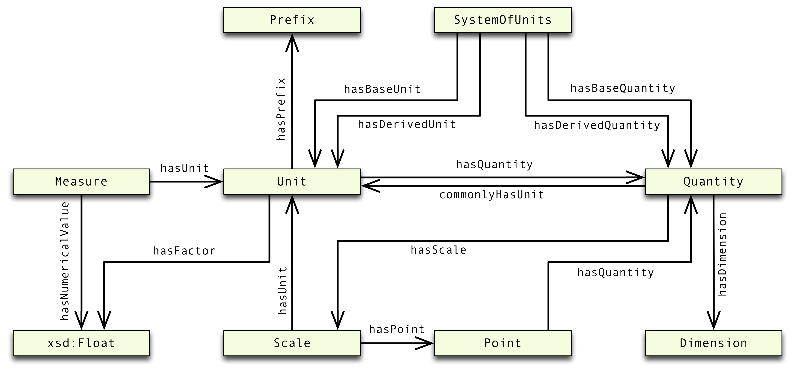
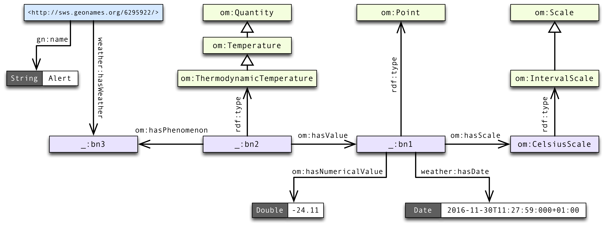

# OM - 測定単位のオントロジー

〔訳注: この文書は，[2019年8月30日時点のREADME](https://github.com/HajoRijgersberg/OM/blob/5e061da5fb1c78ff75d2b800361e42ca954834a4/README.md)の，技術的内容を変更しない日本語訳である。〕


**測定単位のオントロジー (Ontology of units of Measure; OM) 2.0**は，科学技術にとって重要な概念及び関係をモデル化する。OMは，単位・量・測定・次元に特に焦点を当てている。
OMは[OWL 2 - ウェブ・オントロジー言語](https://www.w3.org/TR/owl2-overview/)に基づいている。

**基底URI:** `http://www.ontology-of-units-of-measure.org/resource/om-2/`

**名前空間接頭辞:** `om`


#### 概要

* [測定単位のオントロジー](#om)
* [記録表オントロジー](#recordtable)
* [ソフトウェア](#software)
* [旧版](#previous-versions)
* [謝辞](#acknowledgements)
* [OMについての論文](#papers)


### <a name="om"></a>測定単位のオントロジー

OMオントロジーは，測定値及び単位の定義・利用の為の種々の概念を表す，クラス・インスタンス・及びプロパティを提供する。OMは，例えば国際単位系のメートル (`om:metre`) やキログラム (`om:kilogram`) といった一般的な単位だけではなく，マイル (`om:mile`) や〔国際〕海里 (`om:nauticalMile-International`) といった他の単位から派生した単位をも提供する。多くの応用分野に対しては，ハッブル常数の単位であるキロメートル毎秒毎パーセク(km/s/Mpc) (`om:kilometrePerSecond-TimePerMegaparsec`) や花瓶に生けられた花の寿命 (`om:VaseLife`) といったより具体的な単位と量が提供されている。

OMは次の*応用分野*に対応している:

* 幾何学
* 力学
* 熱力学
* 電磁気学
* 流体力学
* 化学物理学
* 測光
* 放射測定及び放射線生物学
* 核物理学
* 天文学及び天体物理学
* 宇宙論
* 地球科学
* 気象学
* 材料科学
* 微生物学
* 経済学
* 情報技術
* 活版印刷
* 運送
* 食品工学
* 収穫後技術
* 味感・食感の力学
* 包装(梱包)



**図1.** OMのクラス構造を表わすUML図

例えば，2016年11月30日午前11時28分における[カナダ・アラート](https://ja.wikipedia.org/?curid=1642577)〔訳注: 最北端の定住地〕の気温は次のように記述される:

```turtle
_:bn1 rdf:type om:Point ;
	   om:hasScale om:CelsiusScale ;
	   om:hasNumericalValue "-24.11"^^xsd:double ;
	   weather:hasDate "2016-11-30T11:27:59:000+01:00"^^xsd:dateTime .
_:bn2 om:hasValue _:bn1 .
_:bn2 rdf:type om:ThermodynamicTemperature .
_:bn2 om:hasPhenomenon _:bn3 .
<http://sws.geonames.org/6295922/> weather:hasWeather _:bn3 ;
	   gn:name "Alert" ;
	   gn:alternateName "アラート"@ja .
```

ここで`weather`及び`gn`は他の名前空間の接頭辞である（`gn`は[geonames](http://www.geonames.org)名前空間）。`Point`のインスタンスにおける`weather:hasDate`の参照はOMの範疇ではない。

この例に対するRDF図式は次の通り。



**図 2.** カナダ・アラートにおける気温情報のRDF図式

> OMでは，温度などの尺度は，対応する単位とは異なる方法で処理される。例えば，温度差は°CやKなどの単位を使用した目盛として表される（28 °C = 28 Kである）。一方で，28 °Cの絶対的温度は**摂氏目盛**と呼ばれ，301 Kと等しい。通常，〔絶対的量は使われず〕尺度が用いられる。
 
OMは，NIST発行の[国際単位系の使用の手引き](http://physics.nist.gov/cuu/pdf/sp811.pdf)といった幾つかの公文書標準に根差している。  
〔訳注: 日本語訳においては，加えて[JIS Z 8000](https://www.jisc.go.jp/app/jis/general/GnrJISNumberNameSearchList?show&jisStdNo=Z8000)「量及び単位」系列の一連の規格を，主に訳語の参考に用いた。〕

### <a name="recordtable"></a>記録表オントロジー

OMリポジトリは，既存のRDFデータ・キューブ標準の補足として，表形式データを意味的にモデル化する為の[RecordTable](https://github.com/HajoRijgersberg/OM/blob/master/record_table.ttl)語彙を収録している。
RDF記録表は，自己記述的言及を含む記録の入れ子構造を持ち，又不規則な・欠落した・及び予期しないデータに対処できる。
こうして，RDFデータ・キューブの制限を回避し，科学及び工学で生じるような複雑なデータを模型化できる。

### <a name="software"></a>ソフトウェア

OMの使用を補助する，又OMを利用するソフトウェアパッケージが幾つかある。

* [`om-java-libs`](https://github.com/dieudonne-willems/om-java-libs): 単位間変換にOMを利用するJava製ソフトウェアライブラリ。


### <a name="previous-versions"></a>旧版

旧版はwurvocプラットフォームで配布されている。

* OM 1.8: [http://www.wurvoc.org/vocabularies/om-1.8/](http://www.wurvoc.org/vocabularies/om-1.8/)


### <a name="acknowledgements"></a>謝辞

シラー大学〔訳注: ドイツの公立大学〕のJan Martin Keil氏及びSirko Schindler氏にあたっては，OMの査読をして頂いた（[Unit Ontology Review](https://github.com/fusion-jena/unit-ontology-review)及びその[文献](http://www.semantic-web-journal.net/system/files/swj1825.pdf)参照）。


### <a name="papers"></a>OMについての論文

1. H. Rijgersberg, M.L.I. Wigham, J.L. Top, “How semantics can improve engineering processes. A case of units of measure and quantities.” *Advanced Engineering Informatics*, **25**, 2, 2011, pp. 276-287.
2. D.J.M. Willems, H. Rijgersberg, J.L. Top, “Identifying and extracting quantitative data in annotated text”, *Proceedings of the Workshop on Semantic Web and Information Extraction (SWAIE 2012)*, Galway, Ireland, 2012, pp. 43-54.
3. H. Rijgersberg, M.F.J. van Assem, J.L. Top, “Ontology of Units of Measure and Related Concepts.” *Semantic Web*, **4**, 1, 2013, pp. 3-13.
4. Top, J., Wigham, M., Rijgersberg, H. Semantically Enriched Spreadsheet Tables in Science and Engineering. *SEMAPRO 2014*.
5. Mari Wigham, Hajo Rijgersberg, Martine de Vos, Jan Top. Semantic Support for Tables using RDF Record Table. *International Journal On Advances in Intelligent Systems*, **8** (1 and 2), 2015, 128-144.
6. Martine de Vos, Jan Wielemaker, Hajo Rijgersberg, Guus Schreiber, Bob Wielinga, Jan Top. Combining Information on Structure and Content to Automatically Annotate Scientific Spreadsheet Tables. *Int. J. Human-Computer Studies*, 103, 2017, pp. 63-76.
7. Jan Martin Keil, Sirko Schindler. Comparison and Evaluation of Ontologies for Units of Measurement. *Semantic Web*, **1**, 2018, pp. 1-19.
